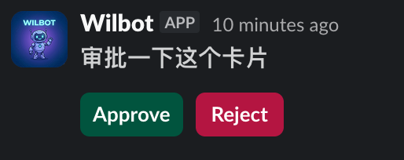
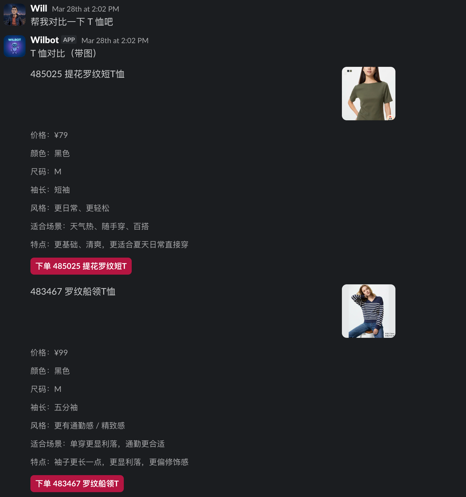

# openclaw-slack-blockkit-bridge

OpenClaw plugin for sending native Slack Block Kit cards and handling interactive button clicks.

Send interactive cards to Slack and handle button clicks — all driven by your OpenClaw agent.

**Built-in templates** (approval, task-progress, pick-one) work out of the box:



**Custom Block Kit layouts** let you build rich cards with images, structured content, and multiple actions:



## Installation

```bash
openclaw plugins install openclaw-slack-blockkit-bridge
```

## Requirements

- OpenClaw v2026.4.2+
- A Slack bot token with `chat:write` and `chat:write.public` scopes

| Plugin version | OpenClaw version |
|----------------|------------------|
| 0.1.x          | v2026.4.2+       |

## Configuration

Add to your `~/.openclaw/openclaw.json` under `plugins.entries`:

```json
"slack-blockkit-bridge": {
  "enabled": true,
  "config": {
    "backend": "direct-slack-api",
    "deliveryMode": "live",
    "tokenFile": "/path/to/slack-bot.token",
    "allowChannels": ["YOUR_CHANNEL_ID"]
  }
}
```

| Field | Type | Default | Description |
|-------|------|---------|-------------|
| `backend` | `"direct-slack-api"` | `"direct-slack-api"` | Delivery backend |
| `deliveryMode` | `"mock" \| "live"` | `"mock"` | Set to `"live"` to send real messages |
| `botToken` | string | — | Slack bot token (prefer `tokenFile`) |
| `tokenFile` | string | — | Path to a file containing the bot token |
| `allowChannels` | string[] | `[]` | Slack channel IDs the plugin is allowed to post to |
| `requestTimeoutMs` | number | `10000` | HTTP request timeout |
| `debug` | boolean | `false` | Enable verbose logging |

## Agent exec permissions

When an agent calls gateway methods via the CLI, add `openclaw` to its exec allowlist in `~/.openclaw/exec-approvals.json`:

```json
{
  "defaults": {},
  "agents": {
    "main": {
      "security": "allowlist",
      "ask": "off",
      "allowlist": [
        { "host": "gateway", "bin": "/usr/local/bin/openclaw" }
      ]
    }
  }
}
```

Replace `/usr/local/bin/openclaw` with the path from `which openclaw`. Changes take effect immediately — no gateway restart needed.

> **Note:** If `openclaw doctor --fix` rewrites the `defaults` block, re-check that `defaults` stays empty (`{}`). A non-empty `defaults.security` overrides per-agent settings in OpenClaw 4.2.

## Quick Start

Send an approval card (replace `YOUR_CHANNEL_ID` with a Slack channel ID):

```bash
openclaw gateway call slack-blockkit-bridge.send-template --json --params '{
  "kind": "approval",
  "channel": "YOUR_CHANNEL_ID",
  "title": "Deploy to production?"
}'
```

Post into an existing thread:

```bash
openclaw gateway call slack-blockkit-bridge.send-template --json --params '{
  "kind": "approval",
  "channel": "YOUR_CHANNEL_ID",
  "threadTs": "1234567890.123456",
  "title": "Deploy to production?"
}'
```

From an agent, use the native `gateway_call(method, params)` tool if available, or call via exec:

```bash
openclaw gateway call slack-blockkit-bridge.health --json
```

## Gateway methods

| Method | Description |
|--------|-------------|
| `slack-blockkit-bridge.health` | Returns plugin status, active path, available templates, and config summary |
| `slack-blockkit-bridge.send-template` | Send a card from a built-in template |
| `slack-blockkit-bridge.send` | Send a raw Block Kit card |
| `slack-blockkit-bridge.update` | Update an existing card by `cardId` |

## Templates

### `send-template` params

| Param | Required | Description |
|-------|----------|-------------|
| `kind` | yes | `"approval"`, `"task-progress"`, or `"pick-one"` |
| `channel` | yes | Slack channel ID |
| `title` | yes | Main question or heading |
| `body` | no | Supporting text below the title |
| `threadTs` | no | Post as a reply in this thread |
| `options` | pick-one: yes | Button options: `{ value, label, style? }`. Min 2 for pick-one |
| `postActionRenderMode` | no | `"replace"` (default) or `"preserve"` |
| `sessionKey` | no | Identifier for correlating with a session or task |
| `metadata` | no | Arbitrary key-value data stored with the card |
| `dryRun` | no | `true` to preview the payload without sending |

### Template kinds

**`approval`** — Approve / Reject buttons

```bash
openclaw gateway call slack-blockkit-bridge.send-template --json --params '{
  "kind": "approval",
  "channel": "YOUR_CHANNEL_ID",
  "title": "Merge this PR?",
  "body": "Branch: feature/new-ui"
}'
```

**`task-progress`** — Start / Done buttons

```bash
openclaw gateway call slack-blockkit-bridge.send-template --json --params '{
  "kind": "task-progress",
  "channel": "YOUR_CHANNEL_ID",
  "title": "Start the data export now?"
}'
```

**`pick-one`** — Custom option buttons (min 2)

```bash
openclaw gateway call slack-blockkit-bridge.send-template --json --params '{
  "kind": "pick-one",
  "channel": "YOUR_CHANNEL_ID",
  "title": "Which environment?",
  "options": [
    { "value": "staging", "label": "Staging", "style": "primary" },
    { "value": "prod", "label": "Production", "style": "danger" }
  ]
}'
```

### Post-action render modes

- **`replace`** (default): card is replaced with `✅ Handled: {label}` after a button click
- **`preserve`**: original card stays visible, the chosen button is marked, a result block is appended

## Custom cards (`send`)

For full Block Kit control, use `send` directly. All interactive button `action_id` values must start with `wbk:`:

```bash
openclaw gateway call slack-blockkit-bridge.send --json --params '{
  "channel": "YOUR_CHANNEL_ID",
  "text": "Review request",
  "blocks": [
    {
      "type": "section",
      "text": { "type": "mrkdwn", "text": "*Review request*\nApprove or reject?" }
    },
    {
      "type": "actions",
      "elements": [
        { "type": "button", "action_id": "wbk:review:approve", "text": { "type": "plain_text", "text": "Approve" }, "style": "primary" },
        { "type": "button", "action_id": "wbk:review:reject", "text": { "type": "plain_text", "text": "Reject" }, "style": "danger" }
      ]
    }
  ],
  "actions": [
    { "actionId": "wbk:review:approve", "actionName": "approve" },
    { "actionId": "wbk:review:reject", "actionName": "reject" }
  ]
}'
```

## Interaction resolution

The runtime exposes a `resolveInteraction?(...)` seam that lets callers customize post-click behavior without modifying the plugin:

- override reply text for a specific action
- suppress or replace the default handled-card update
- supply custom blocks, metadata, or state patches
- choose post-action render mode per card

App-specific logic (quiz grading, routing, etc.) belongs in the caller's resolver, not in this plugin.

## Local development

```bash
npm run build   # compile src/**/*.ts → dist/
npm test        # build test fixtures + run tests
npm pack        # build and pack for distribution
```

## Troubleshooting

### `exec denied: host=gateway security=deny`

**Cause (OpenClaw 4.2):** `openclaw doctor --fix` writes `"security": "deny"` into the `defaults` block of `~/.openclaw/exec-approvals.json`. In 4.2, `defaults.security` takes priority over per-agent settings, blocking all exec calls.

**Fix:**

1. Clear the `defaults` block:
   ```json
   "defaults": {}
   ```
2. Set each agent's security explicitly to prevent them from inheriting the permissive default:
   ```json
   "agents": {
     "main": { "security": "allowlist", "ask": "off", "allowlist": [...] },
     "other-agent": { "security": "deny" }
   }
   ```
3. Confirm `openclaw` full path is in the allowlist (`which openclaw`).

No gateway restart needed — the file is hot-reloaded.
